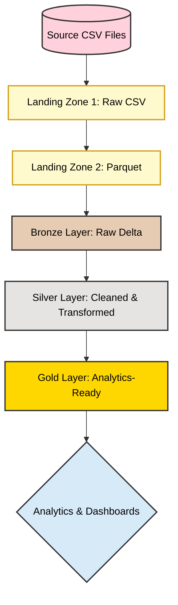

# 🚀 Azure End-to-End E-Commerce Data Platform  
### Medallion Architecture with Azure Databricks

## 📌 Project Overview

This project demonstrates a **production-grade end-to-end data engineering pipeline** for e-commerce data using **Microsoft Azure** and **Databricks Medallion Architecture**.  
It showcases how raw data is ingested, transformed, and served for analytics using **cloud-native, scalable, and enterprise-ready design patterns**.

---

## 🏗 Architecture Overview

The platform follows a **layered Medallion Architecture**:

---

## 🔹 Data Flow Explanation

### 1️⃣ Data Ingestion – Landing Zone 1
- Raw CSV files are **manually uploaded** into **Azure Data Lake Storage Gen2**
- Data is stored **as-is** (schema-on-read)
- Acts as a **system of record** for replay and audit

---

### 2️⃣ CSV → Parquet Conversion – Landing Zone 2
- **Azure Data Factory (ADF)** pipeline converts CSV files into **Parquet**
- Improves:
  - Query performance
  - Compression efficiency
  - Downstream processing speed

---

### 3️⃣ Bronze Layer (Databricks)
- Reads Parquet files from Landing Zone 2
- Performs **append-only ingestion** into Delta tables
- No transformations applied
- Preserves raw structure and ingestion metadata

---

### 4️⃣ Silver Layer (Databricks)
- Cleans and standardizes data
- Handles:
  - Null values
  - Duplicates
  - Data type corrections
- Applies business-level transformations
- Implements efficient incremental processing

---

### 5️⃣ Gold Layer (Databricks)
- Creates **business-ready, analytics-optimized tables**
- Aggregates and joins cleaned data
- Serves as the **single source of truth** for reporting

---

## 🔁 Pipeline Orchestration

- **Event-based triggers** activate pipelines when new data arrives
- Single trigger with **conditional processing** ensures efficiency
- Prevents unnecessary recomputation of static datasets

---

## 📊 Analytics & Consumption

- **Azure Synapse Analytics** used for SQL-based analytics
- **Databricks Dashboards** for interactive visualizations
- Gold layer tables are queried directly for insights

---

## 🛠 Tech Stack

- Azure Data Factory  
- Azure Data Lake Storage Gen2  
- Azure Databricks  
- Delta Lake  
- Parquet  
- Azure Synapse Analytics  

---

---

## 🎯 Key Learnings

- Designing scalable cloud data architectures
- Implementing Medallion Architecture in Databricks
- Building event-driven ETL pipelines
- Optimizing storage and analytics using Parquet & Delta Lake
- Applying real-world data engineering best practices

---

## 🚀 Future Enhancements

- Implement Auto Loader for streaming ingestion  
- Add data quality checks and validations  
- Integrate Power BI dashboards  
- Enable CI/CD for Databricks workflows  

---

## 🤝 Connect

If you’re interested in **Data Engineering, Azure, or Databricks**, feel free to connect or explore the notebooks in this repository.

